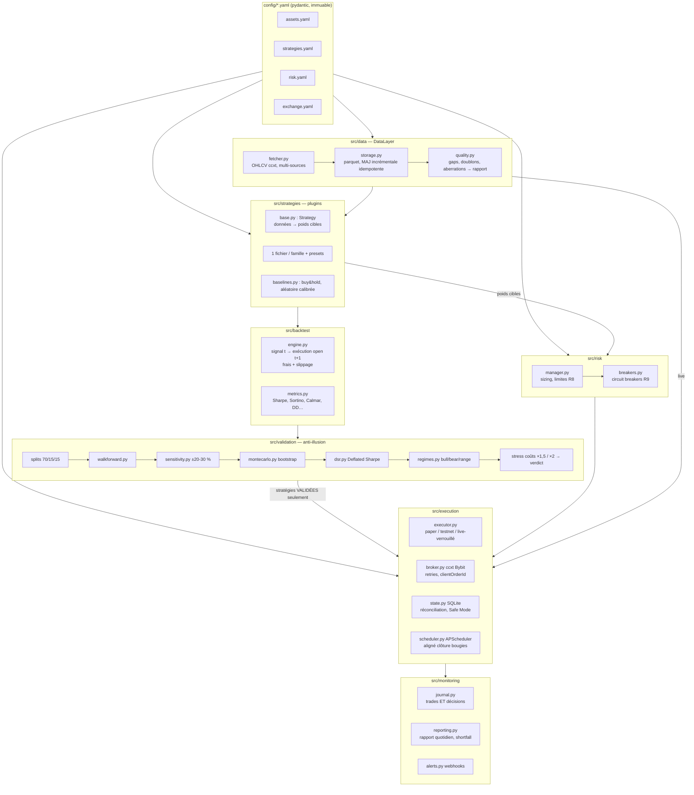

# ARCHITECTURE

**Date :** 2026-07-06 · Décisions sources : ADR-001 (stack), ADR-002 (Bybit + données
Binance publiques), ADR-003 (sur mesure + ccxt).

## Vue d'ensemble



## Principes non négociables

1. **Une stratégie ne touche jamais l'exécution ni le risque.** Elle reçoit des données
   OHLCV et retourne des **poids cibles** ∈ [0, 1] par (timestamp, actif). Point final.
2. **Les limites de risque vivent dans l'exécuteur** (R8) : quelle que soit la demande
   des stratégies, `RiskManager.clamp()` est appliqué en dernier ; tout refus est journalisé.
3. **Anti-lookahead par construction** : le moteur de backtest décale les poids d'une
   bougie (`weights.shift(1)`) et exécute à l'open t+1 ; le runner live n'alimente les
   stratégies qu'avec des bougies **clôturées**. Même chemin de code pour le calcul des
   signaux en backtest et en live.
4. **Multi-actifs × multi-stratégies natif** : le contrat de la stratégie est une matrice
   de poids (index=temps, colonnes=actifs). Une stratégie mono-actif remplit une colonne.
   L'agrégation portefeuille (somme des poids ≤ exposition max) se fait dans le RiskManager.
5. **Config immuable au runtime** (R10) : modèles pydantic `frozen`, chargés une fois au
   démarrage. Aucune donnée externe ne peut les modifier.
6. **Paper d'abord** : `mode: paper` simule les fills localement sur données live publiques
   Bybit (pas de clé nécessaire). `testnet`/demo = clés dédiées. `live` verrouillé (R6).

## Contrats d'interface

### Strategy (src/strategies/base.py)
```python
class Strategy(ABC):
    name: str
    params: dict

    @abstractmethod
    def generate_targets(self, data: dict[str, pd.DataFrame]) -> pd.DataFrame:
        """data[symbol] = OHLCV indexé en UTC ; retourne les poids cibles [0,1].

        Contrat anti-lookahead : la valeur à l'index t ne doit dépendre QUE des
        bougies ≤ t. Le décalage d'exécution (t+1) est fait par le moteur, pas ici.
        """
```

### BacktestEngine (src/backtest/engine.py)
- Entrées : prix (open/close), matrice de poids cibles, `FeesConfig`, `SlippageConfig`.
- Exécution : `poids_effectifs[t] = poids_cibles[t-1]` ; les changements de position
  s'exécutent à `open[t]` ; coût = turnover × (taker + slippage).
- Sorties : equity curve, liste des trades, `Metrics` (rendement, Sharpe, Sortino, Calmar,
  max DD + durée, profit factor, win rate, expectancy, exposition, turnover, frais cumulés).

### RiskManager (src/risk/manager.py)
- `clamp(targets, portfolio_state) -> targets_bornés` (ordre max, position max, exposition max).
- `check_breakers(portfolio_state, api_health) -> Action` (CONTINUE | PAUSE | HALT) selon
  `risk.yaml` : pertes consécutives, perte horaire/journalière, drawdown, erreurs API,
  divergence de réconciliation.

### Executor (src/execution/executor.py)
- Boucle : à chaque clôture de bougie (APScheduler) → données fraîches → stratégies →
  RiskManager → ordres (paper fill simulé ou ccxt) → persistance SQLite → journal.
- Démarrage : recharge l'état → **réconciliation** (exchange vs local) → divergence
  au-delà de la tolérance → Safe Mode + alerte, pas de trading.
- `scripts/kill.py` : pose un flag d'arrêt + annule les ordres ouverts + position → 0 optionnel.

## Flux de données

1. **Backtest** : parquet (Binance public 2017+) → quality report → stratégies → moteur → validation → verdicts.
2. **Paper** : klines publiques Bybit (bougies clôturées) → mêmes stratégies → RiskManager →
   fills simulés (open bougie suivante + slippage) → SQLite + journal → rapports.
3. **Testnet/demo** : idem paper mais ordres réels sur `api-demo.bybit.com` (clés demo).

## Persistance

- Données marché : `data/{source}/{symbol}/{timeframe}.parquet`.
- État exécution : `state/bot.sqlite` (positions, ordres avec clientOrderId, equity, décisions).
- Logs : `logs/trading_bot.log` (rotatif) ; rapports : `docs/reports/` (quotidiens).

## Choix techniques rappelés

| Sujet | Choix | ADR |
|---|---|---|
| Connectivité | ccxt 4.5.64 | ADR-003 |
| Exchange | Bybit (MiCA FR, testnet+demo) | ADR-002 |
| Historique | Binance public (2017+) | ADR-002 |
| Stockage | parquet (pyarrow) | ADR-001 |
| Scheduler | APScheduler 3.11 | ADR-001 |
| Moteur backtest | sur mesure + contre-vérif backtesting.py | ADR-003 |
